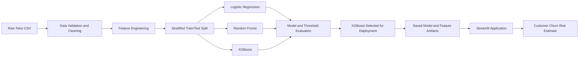
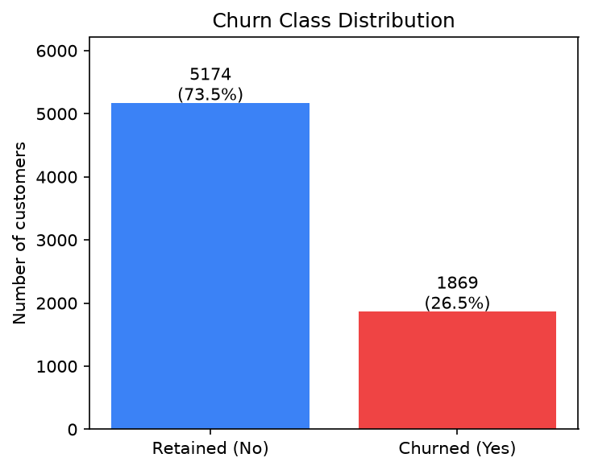
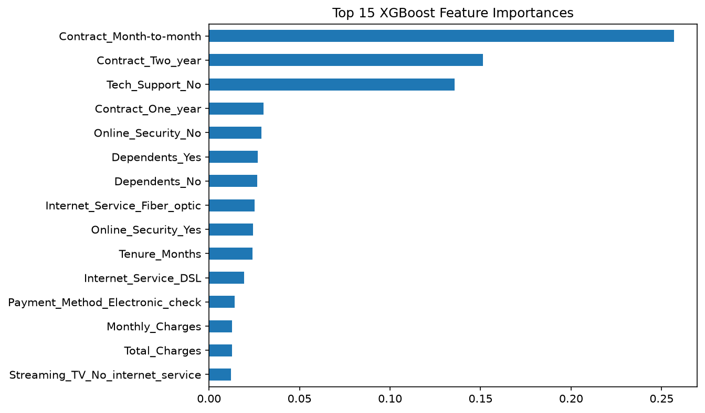
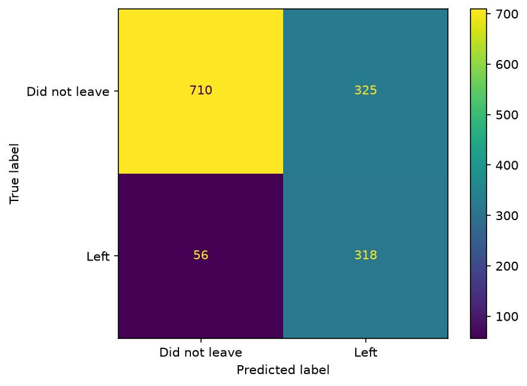

# Telco Customer Churn Prediction

Team Members: Kazi Hossain, Sebastian Arrieta, Tanish Gupta, Vic Chen, Rajeswari Anand, and Mari Kathleen Abdon

## Project Overview

Our Telco Customer Churn Prediction project is a machine learning project which predicts which telecom customers are likely to churn. This is important because customer churn is a major cost for any subscription-based businesses. A company will lose on recurring revenue and the expense in obtaining that customer. Therefore, being able to flag customers that are likely to leave will allow the company to try retaining them before they completely cancel.

**Research Question**: Can a machine learning classifier trained on Telco customer data reliably identify potential churners?

**Dataset**: the models are trained on `telco-data/WA*Fn-UseC*-Telco-Customer-Churn.csv

Our goal was to optimize for more than raw accuracy. Since churners are the minority class, our team tracks _recall on churners_ (how many actual churners the model catches) alongside precision, F1, and ROC-AUC

### End-to-End Pipeline

## Visuals & Design

| Visual                                                            | What it shows                                                                                                                                                                                                                                                                                                                                                                                                                                                                                                                                                                                                                    |
| ----------------------------------------------------------------- | -------------------------------------------------------------------------------------------------------------------------------------------------------------------------------------------------------------------------------------------------------------------------------------------------------------------------------------------------------------------------------------------------------------------------------------------------------------------------------------------------------------------------------------------------------------------------------------------------------------------------------- |
|               | Out of 7,043 customers, abour 26.6% (1,869) churned while 73.4 (5,174) stayed. There is about a 3:1 imbalance which is why our project focuses recall, precision, and F1 on the churned class instead of relying on overall accuracy.                                                                                                                                                                                                                                                                                                                                                                                            |
|  | `Contract_Month-to-month`, `Contract_Two_year`, and `Tech_Support_No` rank highest and account for over 50% in XGBoost feature importances. Contract type contributes more than any other factor, which confirms that month-to-month customers are more likely to churn while two-year contract holders are far less likely to. Right below the Contract features is Contract_One_year, followed by Online_Security_No, Dependents_Yes/Dependents_No, Internet_Service_Fiber_optic, Online_Security_Yes, and Tenure_Months. These signals that lacking security, having no dependents, and shorter tenure also raise churn risk. |
|                   | Out of 1,409 test customers, the model correctly identified 319 of 374 actual churners (85.3% recall) and 721 of 1,035 customers who stayed. It flagged 314 loyal customers as at-risk (false positives) and missed only 55 churners (false negatives). We chose this trade-off to prioritize catching churners over avoiding false alarms. It's because missing a churner costs a lost customer which is more expensive than false positive that only cost unnecessary retention outreach.                                                                                                                                      |

## Model Selection & Evaluation

We compared three classifiers on the same stratified split:

| Metric (on same test customers)      | XGBoost | Logistic Reg. | Random Forest |
| :----------------------------------- | ------: | ------------: | ------------: |
| Leavers caught (recall)              |     78% |           53% |           45% |
| Ranks risk correctly (avg precision) |    0.63 |          0.60 |          0.57 |
| Overall score (ROC-AUC)              |    0.83 |          0.82 |          0.81 |

XGBoost catches far more leavers than the other two models about 78% of churners, versus 53% for Logistic Regression and 45% for Random Forest. It also surpassing them on ranking quality (0.63 average precision) and overall separability (0.83 ROC-AUC). We picked XGBoost because in this use case, missing a leaver costs a lost customer, so a model that catches more of them is worth more than one that's marginally more precise.

## Impact & Bias

**Business impact:** The model is designed for businesses to do a retention action for customers flagged as a high-risk churner such a giving a retention offer or outreach call. A _false negative_ (a churner the model misses) is a lost customer that the company never tries to have, while a _false positive_ (a loyal customer flagged as at-risk) simply costs the price of unnecessary outreach. The team weighted false negatives as more expensive. Therefore, the tuned model's higher recall was chosen over untuned higher precision.

**Bias & fairness:** the feature set includes demographic attributes (`Gender`, `Senior_Citizen`, `Partner`, `Dependents`). Because these correlate with regulated/protected characteristics, using them to influence discount or retention offers risks disparate treatment and should be reviewed before any real deployment.

**Data limitations:** the dataset is a single historical snapshot from one provider (7,043 customers), so performance may not generalize to other companies, regions, or time periods. Churn is also an imbalanced class, so accuracy alone can look acceptable while recall on churners is weak.

**Ethical considerations:** a churn-risk score should be treated as a probability estimate to prioritize outreach, not a certainty about any individual customer. The model is a frozen artifact with no drift monitoring or retraining pipeline, so it should be treated as a project demonstration rather than a production retention system.

## Citations & Documentation

**Dataset:** IBM Telco Customer Churn dataset (`WA_Fn-UseC_-Telco-Customer-Churn.csv`), or https://www.kaggle.com/datasets/blastchar/telco-customer-churn/data

**Libraries & frameworks:** pandas, NumPy, scikit-learn, XGBoost, matplotlib, seaborn, Streamlit.

**References:**

- Bello, A.-W., Ajibade, I., & Ekweli, D. (2025). Predicting customer churn in subscription-based businesses using machine learning. _International Journal of Science and Research Archive, 16_(3), 1024–1038. [https://doi.org/10.30574/ijsra.2025.16.3.2664](https://doi.org/10.30574/ijsra.2025.16.3.2664)
- Gallo, A. (2014). The value of keeping the right customers. In Harvard Business Review. [https://hbr.org/2014/10/the-value-of-keeping-the-right-customers]
- Garcia de Alford, A. S., Hayden, S. K., Wittlin, N., & Atwood, A. (2020). Reducing age bias in machine learning: An algorithmic approach. _SMU Data Science Review, 3_(2), Article 11. [https://scholar.smu.edu/datasciencereview/vol3/iss2/11](https://scholar.smu.edu/datasciencereview/vol3/iss2/11)
- Hardt, M., Price, E., & Srebro, N. (2016). Equality of opportunity in supervised learning. _Advances in Neural Information Processing Systems (NeurIPS)_. [https://home.ttic.edu/~nati/Publications/HardtPriceSrebro2016.pdf](https://home.ttic.edu/~nati/Publications/HardtPriceSrebro2016.pdf)
- Hermawan, A., Saputra, A., Rafi, M. D., Basmallah, S., Putra, Y. T. S., & Nabila, W. (2025). Implementing XGBoost model for predicting customer churn in e-commerce platforms. _Repeater: Publikasi Teknik Informatika dan Jaringan, 3_(2), 17–31. [https://doi.org/10.62951/repeater.v3i2.401](https://doi.org/10.62951/repeater.v3i2.401)
- Manzoor, A., Qureshi, M. A., Kidney, E., & Longo, L. (2024). A review on machine learning methods for customer churn prediction and recommendations for business practitioners. _IEEE Access, 12_, 70434–70463. [https://doi.org/10.1109/ACCESS.2024.3402092](https://doi.org/10.1109/ACCESS.2024.3402092)
- Zhao, T., & Qi, X. (2025). Telecom customer churn prediction with explainable machine learning. In _Proceedings of the 2025 2nd International Conference on Modeling, Natural Language Processing and Machine Learning_ (pp. 246–250). Association for Computing Machinery. [https://doi.org/10.1145/3757110.3757152](https://doi.org/10.1145/3757110.3757152)

## Next Steps

- **Uplift modeling:** our model predicts _who will churn_, but not _who can be saved_. Uplift modeling (e.g. a T-learner/X-learner) would split customers into four groups based on how they respond to an offer: sure things (staying regardless), lost causes (leaving regardless), persuadables (retained _because_ of the offer — the real target), and sleeping dogs (customers who churn _because_ they were contacted, and are better left alone). This lets retention outreach target only persuadables instead of the whole high-risk group, and avoid actively pushing sleeping dogs toward the door.

- **Survival analysis:** we currently output a single churn probability with no sense of timing. Using `tenure` in a Cox Proportional Hazards or Kaplan-Meier model would estimate _when_ a customer is likely to churn (e.g. "40% risk within the next 3 months"), giving retention teams a timing signal instead of a static score.

- **SHAP interaction analysis:** beyond single-feature importances, SHAP interaction values could surface which feature _combinations_ (e.g. month-to-month contract + fiber optic + electronic check) drive the highest risk, turning the feature-importance chart into a small set of named at-risk customer personas retention teams could design specific offers around.
