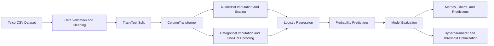

# Telco Customer Churn Prediction


An end-to-end machine-learning project for predicting customer churn in a telecommunications company using customer demographics, subscribed services, account information, contract details, and billing behavior.

> **Interactive Streamlit deployment:** The app now serves the team's final XGBoost workflow from `xgboost_final.ipynb`, rebuilt with the supplied `Telco_customer_churn.csv` dataset. The model starts from 23 source features and uses 1,159 encoded columns at inference. See `DEPLOYMENT.md` for reproducibility and deployment details.

The project builds an interpretable **Logistic Regression** classifier, evaluates its ability to identify customers at risk of leaving, and produces professional visual and tabular outputs for model analysis.

> [!IMPORTANT]
> The primary objective is not only to maximize overall accuracy, but also to improve the identification of churned customers. For this reason, the project evaluates precision, recall, F1 score, ROC-AUC, and confusion matrices in addition to accuracy.

---

## Table of Contents

- [Project Overview](#project-overview)
- [Business Problem](#business-problem)
- [Dataset](#dataset)
- [Machine-Learning Pipeline](#machine-learning-pipeline)
- [Data Preparation](#data-preparation)
- [Modeling Approach](#modeling-approach)
- [Baseline Results](#baseline-results)
- [Model Improvements](#model-improvements)
- [Generated Outputs](#generated-outputs)
- [Repository Structure](#repository-structure)
- [Getting Started](#getting-started)
- [Interpreting the Results](#interpreting-the-results)
- [Known Limitations](#known-limitations)
- [Roadmap](#roadmap)

---

## Project Overview

Customer churn occurs when a customer stops using a company's services. In the telecommunications industry, predicting churn can help a company identify customers who may leave and take retention action before the cancellation occurs.

The target variable in this project is:

```text
Churn
```

The target is converted into a binary variable:

- `0` = customer remained with the company
- `1` = customer churned

The dataset contains **7,043 customer records and 21 original columns**. Each row represents one customer.

The project focuses on the following stages:

1. Load and inspect the Telco Customer Churn dataset.
2. Clean invalid or missing values.
3. Separate numerical and categorical variables.
4. Build a reusable preprocessing and modeling pipeline.
5. Train a Logistic Regression baseline model.
6. Evaluate classification performance using multiple metrics.
7. Tune model hyperparameters and decision thresholds.
8. Generate visualizations and CSV reports for further analysis.

---

## Business Problem

Customer acquisition is often more expensive than customer retention. A churn-prediction model can support retention teams by ranking customers according to their estimated risk of leaving.

A useful churn model should answer questions such as:

- Which customers have the highest probability of churning?
- Which account or service characteristics are associated with churn?
- How many churned customers can the model correctly identify?
- What tradeoff exists between capturing more churners and generating more false alarms?
- Which decision threshold is most appropriate for a retention campaign?

This project treats churn prediction as a **binary classification problem**.

---

## Dataset

The project uses the Telco Customer Churn dataset stored as:

```text
WA_Fn-UseC_-Telco-Customer-Churn.csv
```

### Dataset dimensions

```text
7,043 rows x 21 columns
```

### Feature groups

| Group | Example variables |
|---|---|
| Customer demographics | `gender`, `SeniorCitizen`, `Partner`, `Dependents` |
| Account information | `tenure`, `Contract`, `PaperlessBilling`, `PaymentMethod` |
| Phone services | `PhoneService`, `MultipleLines` |
| Internet services | `InternetService`, `OnlineSecurity`, `OnlineBackup`, `DeviceProtection` |
| Support and entertainment | `TechSupport`, `StreamingTV`, `StreamingMovies` |
| Billing information | `MonthlyCharges`, `TotalCharges` |
| Target | `Churn` |

### Target imbalance

The dataset contains more non-churn customers than churn customers. Because of this imbalance, accuracy alone can provide an incomplete picture of model performance.

The analysis therefore places special attention on:

- Churn recall
- Churn precision
- F1 score
- ROC-AUC
- Precision-recall behavior
- Confusion-matrix errors

---

## Machine-Learning Pipeline



The preprocessing steps and Logistic Regression model are placed inside a Scikit-learn `Pipeline`. This reduces data leakage risk and ensures that the same transformations are applied consistently during training, cross-validation, testing, and future predictions.

---

## Data Preparation

### Customer identifier

`customerID` is an identifier rather than a predictive customer characteristic, so it is removed from the model features and retained only when useful for associating predictions with customers.

### Total charges

`TotalCharges` may be loaded as text because some records contain blank values. The project converts it to a numerical column:

```python
pd.to_numeric(df["TotalCharges"], errors="coerce")
```

Invalid or blank values become missing values and are handled inside the preprocessing pipeline.

### Target conversion

The `Churn` column is converted from `Yes` and `No` values into binary labels:

```text
Yes -> 1
No  -> 0
```

### Numerical preprocessing

Numerical variables are processed using:

- Median imputation for missing values
- Standardization with `StandardScaler`

### Categorical preprocessing

Categorical variables are processed using:

- Most-frequent imputation
- One-hot encoding
- Safe handling of categories that were not present during training

### Train/test split

The dataset is divided into training and testing sets using stratification so that both subsets preserve approximately the same churn proportion.

---

## Modeling Approach

### Baseline model

The baseline classifier is Logistic Regression. It was selected because it:

- Provides a strong and interpretable classification baseline
- Produces churn probabilities
- Works well with standardized numerical variables and one-hot encoded categories
- Allows coefficients to be examined to understand model behavior
- Can incorporate class weighting when churn classes are imbalanced

The full model is trained through a Scikit-learn pipeline containing:

```text
ColumnTransformer -> LogisticRegression
```

### Evaluation metrics

The project reports several complementary metrics:

| Metric | Purpose |
|---|---|
| Accuracy | Overall percentage of correct predictions |
| Precision | Percentage of predicted churners who actually churned |
| Recall | Percentage of actual churners correctly identified |
| F1 score | Balance between churn precision and recall |
| ROC-AUC | Ability to rank churners above non-churners across thresholds |
| Average precision / PR-AUC | Performance focused on the positive churn class |
| Balanced accuracy | Average recall across both classes |
| Brier score | Quality of predicted probabilities |
| Log loss | Penalty for incorrect and overconfident probabilities |

---

## Baseline Results

The baseline Logistic Regression model produced the following test-set results:

| Metric | Score |
|---|---:|
| Accuracy | 0.8055 |
| Precision | 0.6572 |
| Recall | 0.5588 |
| F1 score | 0.6040 |
| ROC-AUC | 0.8420 |

### Initial interpretation

The model correctly classifies approximately **80.6%** of test customers and demonstrates good ranking ability with a **ROC-AUC of 0.8420**.

However, the churn recall of **0.5588** means that the default `0.50` classification threshold identifies only about 56% of the customers who actually churned. This is important because missed churners represent customers who would not be targeted by a retention campaign.

The baseline therefore provides a useful starting point, but further improvement should focus on the balance between:

- Correctly detecting more churners
- Limiting unnecessary retention interventions for customers who would not churn

---

## Model Improvements

The improved workflow extends the baseline with more rigorous model selection and evaluation.

### Stratified cross-validation

`StratifiedKFold` preserves the churn distribution across validation folds and provides a more reliable estimate of model performance than a single train/test split alone.

### Hyperparameter tuning

`GridSearchCV` evaluates combinations of Logistic Regression settings such as:

- Regularization strength
- Penalty type
- Solver compatibility
- Class weighting

The best configuration is selected using a churn-relevant validation metric rather than relying only on training accuracy.

### Threshold optimization

Logistic Regression produces probabilities, while the default classifier converts probabilities into labels using a threshold of `0.50`.

The improved analysis evaluates alternative thresholds to determine whether a lower or higher cutoff provides a better business tradeoff. Threshold selection is performed using validation predictions instead of the final test set to reduce test-set overfitting.

Possible threshold objectives include:

- Maximizing F1 score
- Improving churn recall
- Maximizing balanced accuracy
- Selecting the best precision-recall tradeoff
- Applying a business-defined cost to false negatives and false positives

### Probability evaluation

The improved analysis may also include:

- Precision-recall curves
- Calibration analysis
- Brier score
- Log loss
- Cumulative gains
- Lift analysis

These outputs help determine whether predicted probabilities are useful for ranking and prioritizing customers, even when a single classification threshold is not sufficient.

### Feature interpretation

The model's coefficients are exported and visualized. Positive coefficients increase the model's estimated churn risk, while negative coefficients reduce it, after accounting for the preprocessing and reference categories used by the model.

Coefficient magnitude should be interpreted carefully because one-hot encoding, regularization, correlated features, and scaling can affect the values.

---

## Generated Outputs

### Baseline results

The baseline script creates a `results/` directory containing outputs such as:

```text
results/
├── metrics.csv
├── confusion_matrix.png
├── roc_curve.png
├── feature_coefficients.csv
└── test_predictions.csv
```

### Improved analysis

The improved workflow creates a `results_improved/` directory containing model-comparison and diagnostic outputs such as:

```text
results_improved/
├── model_comparison.csv
├── metrics_comparison.png
├── confusion_matrix_baseline.png
├── confusion_matrix_improved.png
├── roc_comparison.png
├── precision_recall_comparison.png
├── threshold_analysis.png
├── cross_validation_summary.csv
├── grid_search_results.csv
├── improved_feature_coefficients.csv
├── top_feature_coefficients.png
└── final_test_predictions.csv
```

Depending on the final script version, additional calibration, gains, lift, or probability-quality plots may also be generated.

---

## Repository Structure

```text
telco-churn-logistic-regression/
├── WA_Fn-UseC_-Telco-Customer-Churn.csv
├── churn_logistic_regression.py
├── improved_logistic_regression.py
├── README.md
├── requirements.txt
├── results/
│   ├── metrics.csv
│   ├── confusion_matrix.png
│   ├── roc_curve.png
│   ├── feature_coefficients.csv
│   └── test_predictions.csv
└── results_improved/
    ├── model_comparison.csv
    ├── metrics_comparison.png
    ├── confusion_matrix_baseline.png
    ├── confusion_matrix_improved.png
    ├── roc_comparison.png
    ├── precision_recall_comparison.png
    ├── threshold_analysis.png
    ├── cross_validation_summary.csv
    ├── grid_search_results.csv
    ├── improved_feature_coefficients.csv
    ├── top_feature_coefficients.png
    └── final_test_predictions.csv
```

> Adjust the script names in this section if the files use different names in the final repository.

---

## Getting Started

### 1. Clone the repository

```bash
git clone <repository-url>
cd telco-churn-logistic-regression
```

Replace `<repository-url>` with the final GitHub repository URL.

### 2. Create a virtual environment

#### Windows PowerShell

```powershell
python -m venv .venv
.\.venv\Scripts\Activate.ps1
```

#### macOS or Linux

```bash
python3 -m venv .venv
source .venv/bin/activate
```

### 3. Install dependencies

```bash
pip install -r requirements.txt
```

A minimal installation can also be performed with:

```bash
pip install pandas numpy matplotlib scikit-learn
```

Install any additional visualization packages listed in the final script if required.

### 4. Confirm the dataset location

Place the dataset in the project root using the following filename:

```text
WA_Fn-UseC_-Telco-Customer-Churn.csv
```

### 5. Run the baseline model

```bash
python churn_logistic_regression.py
```

### 6. Run the improved analysis

```bash
python improved_logistic_regression.py
```

The scripts print the main evaluation results in the terminal and save detailed files inside their corresponding results directories.

---

## Interpreting the Results

### Confusion matrix

The confusion matrix separates predictions into:

- **True negatives:** customers correctly predicted to stay
- **False positives:** customers predicted to churn who actually stayed
- **False negatives:** customers predicted to stay who actually churned
- **True positives:** customers correctly predicted to churn

For retention use cases, false negatives can be especially costly because the company fails to identify a customer who leaves.

### ROC curve

The ROC curve measures the tradeoff between the true-positive rate and false-positive rate across classification thresholds. A larger ROC-AUC indicates stronger ranking ability.

### Precision-recall curve

The precision-recall curve is especially useful when the positive class is less common. It shows how churn precision changes as the model attempts to capture more churned customers.

### Threshold analysis

Changing the classification threshold changes the number of customers classified as churn risks:

- A lower threshold usually increases recall but reduces precision.
- A higher threshold usually increases precision but reduces recall.

The best threshold depends on the retention budget and the relative business cost of missed churners versus unnecessary interventions.

### Feature coefficients

Coefficient analysis can help identify the customer characteristics most strongly associated with estimated churn risk. These associations should not automatically be interpreted as causal effects.

---

## Known Limitations

### 1. Single historical dataset

The model is trained and evaluated on one customer dataset. Performance may change when applied to customers from another company, region, or time period.

### 2. Observational relationships

The model identifies predictive associations, not causal relationships. A variable with a strong coefficient does not necessarily cause churn.

### 3. Class imbalance

Because churned customers are the minority class, a model can obtain reasonable accuracy while still missing many churners. Class-specific metrics must be monitored.

### 4. Threshold depends on business costs

A statistically optimized threshold may not be the best operational threshold. The final decision should consider campaign cost, customer value, intervention capacity, and the cost of a missed churner.

### 5. No external validation

The model has not yet been evaluated on a separate dataset from another period or telecommunications provider.

### 6. No production deployment

The project currently performs offline training and evaluation. It does not yet include a production API, automated retraining, data-drift monitoring, or a live retention dashboard.

### 7. Possible feature changes over time

Customer behavior and service offerings can change. A production model would require periodic monitoring for data drift and model-performance degradation.

---

## Roadmap

Recommended next steps:

- [x] Clean the Telco Customer Churn dataset.
- [x] Build a preprocessing pipeline for numerical and categorical features.
- [x] Train a Logistic Regression baseline.
- [x] Generate a confusion matrix and ROC curve.
- [x] Export model metrics, coefficients, and customer predictions.
- [x] Add stratified cross-validation and hyperparameter tuning.
- [x] Compare the default and optimized classification thresholds.
- [ ] Finalize the threshold using explicit business costs.
- [ ] Compare Logistic Regression with Random Forest and gradient-boosting models.
- [ ] Add SHAP or another model-explanation method for nonlinear models.
- [ ] Validate the selected model on out-of-time or external data.
- [ ] Add automated data-quality and model-performance tests.
- [ ] Create a customer-risk dashboard or reporting interface.
- [ ] Package the final model for batch or API-based inference.

---

## Project Status Summary

| Component | Status |
|---|---|
| Dataset loading | Complete |
| Data validation and cleaning | Complete |
| Numerical preprocessing | Complete |
| Categorical preprocessing | Complete |
| Stratified train/test split | Complete |
| Logistic Regression baseline | Complete |
| Baseline evaluation | Complete |
| Confusion-matrix visualization | Complete |
| ROC analysis | Complete |
| Hyperparameter tuning | Complete |
| Cross-validation analysis | Complete |
| Threshold analysis | Complete |
| Feature-coefficient analysis | Complete |
| External validation | Not implemented |
| Production deployment | Not implemented |

---

## Conclusion

This project demonstrates a complete and interpretable machine-learning workflow for Telco customer churn prediction. The Logistic Regression baseline provides good overall discrimination, while the improved workflow adds cross-validation, model tuning, threshold analysis, and richer evaluation outputs.

The most important modeling decision is not simply which model has the highest accuracy. A useful retention system must determine how aggressively to identify churn risks based on the business cost of missed churners, false alarms, and retention interventions.
