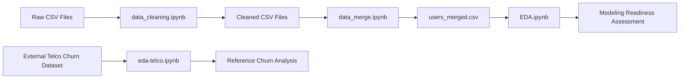

# Netflix Churn Predictor


An end-to-end data preparation and exploratory analysis project for studying customer churn on a synthetic Netflix-style streaming platform.

The repository cleans six interconnected behavioral datasets, validates relationships across them, engineers user-level engagement features, and produces a consolidated modeling table with **10,000 users and 67 columns**. The project also investigates whether the available churn target contains enough predictive signal to support meaningful machine-learning modeling.

> [!IMPORTANT]
> **Current status:** this repository does not yet contain a trained churn prediction model. The implemented pipeline currently covers data cleaning, cross-dataset validation, feature engineering, dataset merging, and exploratory data analysis (EDA).

---

## Table of Contents

- [Project Overview](#project-overview)
- [Key Findings](#key-findings)
- [Pipeline](#pipeline)
- [Dataset](#dataset)
- [Repository Structure](#repository-structure)
- [Data Cleaning](#data-cleaning)
- [Feature Engineering](#feature-engineering)
- [Exploratory Data Analysis](#exploratory-data-analysis)
- [Getting Started](#getting-started)
- [Recommended Notebook Order](#recommended-notebook-order)
- [Generated Outputs](#generated-outputs)
- [Known Limitations](#known-limitations)
- [Roadmap](#roadmap)

---

## Project Overview

Customer churn prediction is typically used to identify subscribers who may cancel or become inactive. In this project, the churn label is:

```text
is_active
```

A value of `False` represents an inactive user and is treated as the churn outcome. After cleaning, the user table contains:

- **8,519 active users**
- **1,481 inactive users**
- **14.81% inactive/churned users**

The broader goal is to transform raw platform activity into user-level behavioral features that could eventually support a churn classifier.

The project currently focuses on four stages:

1. **Clean** noisy synthetic source data.
2. **Validate** IDs and relationships across tables.
3. **Engineer** user-level behavioral and recency features.
4. **Analyze** whether those features contain useful churn signal.

---

## Key Findings

The EDA produced an important result: **the synthetic `is_active` label appears to have been generated largely independently of user behavior**.

Observed consequences include:

- Behavioral features show near-zero correlation with `is_active`.
- Watch activity distributions are nearly identical for active and inactive users.
- Recommendation engagement shows little separation by churn status.
- Tenure does not display the expected churn pattern commonly seen in real subscription data.
- Average progress and completion behavior are nearly indistinguishable between the two target classes.

This means that training a classifier immediately may produce misleading results. The current analysis therefore recommends improving or regenerating the target signal before treating model performance as meaningful.

Additional EDA findings include:

- `monthly_spend` is strongly right-skewed and contains extreme outliers, reaching roughly $998.
- `age` still contains high-end anomalies, including values above 100.
- `rec_click_rate` is heavily zero-inflated because many users never click a recommendation.
- `avg_sentiment` and `avg_review_rating` are highly correlated and may create multicollinearity.
- `total_sessions` and `total_watch_minutes` are also strongly related and may be redundant for some models.

---

## Pipeline



### Main workflow

```text
orig_data/*.csv
      |
      v
data_cleaning.ipynb
      |
      v
cleaned_data/*_clean.csv
      |
      v
data_merge.ipynb
      |
      v
cleaned_data/users_merged.csv
      |
      v
EDA.ipynb
```

---

## Dataset

The repository uses a synthetic Netflix-style dataset covering user activity from **January 1, 2024 through December 31, 2025**.

### Raw data

| File | Rows | Description |
|---|---:|---|
| `users.csv` | 10,300 | User demographics, plans, account status, and spending |
| `movies.csv` | 1,040 | Content metadata, genres, ratings, and production attributes |
| `watch_history.csv` | 105,000 | Viewing sessions, completion behavior, devices, and progress |
| `reviews.csv` | 15,450 | Ratings, review sentiment, and voting activity |
| `recommendation_logs.csv` | 52,000 | Recommendation exposure, scores, clicks, and algorithms |
| `search_logs.csv` | 26,500 | Search queries, clicks, duration, filters, and devices |
| **Total** | **210,290** | Records across six connected tables |

### Cleaned data

| File | Rows | Columns |
|---|---:|---:|
| `users_clean.csv` | 10,000 | 16 |
| `movies_clean.csv` | 1,000 | 19 |
| `watch_history_clean.csv` | 100,000 | 12 |
| `reviews_clean.csv` | 14,993 | 12 |
| `recommendation_logs_clean.csv` | 50,000 | 11 |
| `search_logs_clean.csv` | 25,000 | 11 |
| `users_merged.csv` | 10,000 | 67 |

> The source data intentionally includes missing values, duplicates, outliers, and inconsistent records so that the project can demonstrate realistic data-cleaning decisions.

---

## Repository Structure

```text
netflix-churn-predictor-main/
├── orig_data/
│   ├── README.md
│   ├── users.csv
│   ├── movies.csv
│   ├── watch_history.csv
│   ├── reviews.csv
│   ├── recommendation_logs.csv
│   └── search_logs.csv
│
├── cleaned_data/
│   ├── users_clean.csv
│   ├── movies_clean.csv
│   ├── watch_history_clean.csv
│   ├── reviews_clean.csv
│   ├── recommendation_logs_clean.csv
│   ├── search_logs_clean.csv
│   └── users_merged.csv
│
├── data_cleaning.ipynb   # Cleaning, validation, and cleaned exports
├── data_merge.ipynb      # User-level feature engineering and merging
├── EDA.ipynb             # EDA of the engineered Netflix-style dataset
├── eda-telco.ipynb       # Reference EDA using an external Telco churn dataset
└── .gitignore
```

---

## Data Cleaning

The `data_cleaning.ipynb` notebook processes every raw table separately and then performs cross-dataset integrity checks.

### Users

Key operations include:

- Replacing invalid ages below 13 using subscription-plan group statistics.
- Filling missing ages by subscription-plan mean.
- Filling missing gender values with `Unknown`.
- Investigating `monthly_spend` outliers using the IQR method.
- Filling missing spending values using plan-level means calculated from non-extreme observations.
- Filling missing household size by subscription-plan mean.
- Removing duplicate `user_id` values.
- Converting date columns to appropriate datetime types.

### Movies

Key operations include:

- Filling missing secondary genres with `None`.
- Setting missing season and episode counts to zero where appropriate.
- Checking rating and metadata consistency.
- Removing duplicate `movie_id` values.
- Adding a `has_imdb_rating` indicator.

### Watch history

Key operations include:

- Filling missing watch duration with the global median.
- Filling missing progress percentage with the global median.
- Preserving missing user ratings because most sessions do not include a rating.
- Removing duplicate `session_id` values.
- Validating positive durations, progress bounds, and user-rating ranges.

A notable consistency issue was discovered: many rows marked as `completed` have progress below 90%, suggesting that `action` and `progress_percentage` should not be assumed to represent the same concept.

### Reviews

Key operations include:

- Filling vote counts using rating-group statistics.
- Filling sentiment scores using sentiment-group means.
- Checking whether helpful votes exceed total votes.
- Removing repeated user/movie review combinations.
- Preserving domain-specific missingness where appropriate.

### Recommendation logs

Key operations include:

- Filling missing recommendation scores by recommendation-type median.
- Filling missing algorithm versions with `Unknown`.
- Removing duplicate recommendation IDs.
- Validating score and interaction fields.

### Search logs

Key operations include:

- Mapping missing click positions to `0` when no result was clicked.
- Filling missing search duration with the median.
- Removing duplicate search IDs.
- Detecting impossible clicks where the clicked position exceeds the number of returned results.
- Replacing invalid click positions with `NaN`.

### Cross-dataset validation

The cleaning notebook verifies that foreign keys in behavioral tables map to valid entities:

- `user_id` values must exist in the cleaned users table.
- `movie_id` values must exist in the cleaned movies table.
- Watch, review, recommendation, and search records are checked for orphaned references.

---

## Feature Engineering

The `data_merge.ipynb` notebook aggregates event-level activity into a single row per user.

A fixed reference date is currently used:

```python
reference_date = pd.Timestamp("2025-12-31")
```

The final `users_merged.csv` contains **10,000 rows and 67 columns**.

### Feature groups

| Group | Examples |
|---|---|
| User/account | `age`, `subscription_plan`, `monthly_spend`, `tenure_days`, `is_active` |
| Watch behavior | `total_sessions`, `unique_titles_watched`, `total_watch_minutes`, `avg_progress` |
| Completion & frequency | `pct_completed`, `sessions_per_month`, `sessions_per_active_day` |
| Content preference | `avg_imdb_watched`, `unique_genres`, `pct_originals` |
| Watch recency | `first_watch_date`, `last_watch_date`, `days_since_last_watch` |
| Reviews | `review_count`, `avg_review_rating`, `avg_sentiment`, `pct_positive_reviews` |
| Review recency | `days_since_last_review`, `days_since_last_positive_review` |
| Recommendations | `rec_count`, `rec_click_rate`, `avg_rec_score`, `days_since_last_rec_click` |
| Search behavior | `search_count`, `search_click_rate`, `avg_click_position`, `avg_search_duration` |
| Search frequency | `searches_per_month`, `searches_per_active_day`, `active_search_days` |
| Activity flags | `has_watch_history`, `has_reviews`, `has_recs`, `has_searches` |

### Missing-activity strategy

The merge notebook distinguishes between missing data and lack of user activity:

- Count features are filled with `0` when a user has no activity.
- Engagement flags are created before other missing values are filled.
- Recency fields for users who never performed an action are filled with `9999`.
- Rate, average, and frequency features are generally filled with `0` when no activity exists.

This approach preserves the difference between "unknown" and "never engaged," although the `9999` sentinel should be reconsidered before modeling.

---

## Exploratory Data Analysis

### `EDA.ipynb`

This notebook analyzes the engineered Netflix-style user table and covers:

- Missing-value patterns
- Numerical summaries
- Target distribution
- Feature distributions
- Active vs. inactive user comparisons
- Correlation analysis
- Multicollinearity checks
- Modeling-readiness assessment

The most important conclusion is that the current synthetic target has insufficient behavioral signal for meaningful churn modeling.

### `eda-telco.ipynb`

This notebook is a separate reference analysis built around an external Telco Customer Churn dataset. It explores:

- Churn class imbalance
- Contract type
- Tenure
- Internet service
- Technical support
- Payment method
- Multi-feature churn interactions

It is useful as a comparison case because real churn-oriented datasets typically show stronger relationships between customer behavior and the target than the current synthetic streaming label does.

> [!NOTE]
> `eda-telco.ipynb` is not part of the main Netflix-style processing pipeline and depends on an external Kaggle dataset.

---

## Getting Started

### 1. Clone or download the repository

```bash
git clone <repository-url>
cd netflix-churn-predictor-main
```

Replace `<repository-url>` with the actual GitHub repository URL.

### 2. Create a virtual environment

#### macOS / Linux

```bash
python3 -m venv venv
source venv/bin/activate
```

#### Windows PowerShell

```powershell
python -m venv venv
.\venv\Scripts\Activate.ps1
```

### 3. Install the main dependencies

```bash
pip install jupyter pandas numpy matplotlib seaborn
```

For the optional Telco reference notebook, you may also need:

```bash
pip install kagglehub
```

### 4. Start Jupyter

```bash
jupyter notebook
```

Or, with JupyterLab:

```bash
pip install jupyterlab
jupyter lab
```

---

## Recommended Notebook Order

Run the main notebooks in this order:

### 1. Clean the raw datasets

```text
data_cleaning.ipynb
```

Reads from:

```text
orig_data/
```

Writes cleaned tables to:

```text
cleaned_data/
```

### 2. Engineer features and merge datasets

```text
data_merge.ipynb
```

Reads the cleaned tables and creates:

```text
cleaned_data/users_merged.csv
```

### 3. Explore the final modeling table

```text
EDA.ipynb
```

Reads:

```text
cleaned_data/users_merged.csv
```

### 4. Optional reference analysis

```text
eda-telco.ipynb
```

This notebook uses an external Kaggle Telco Customer Churn dataset and is independent of the main pipeline.

---

## Generated Outputs

The primary modeling-ready artifact is:

```text
cleaned_data/users_merged.csv
```

Expected shape:

```text
10,000 rows x 67 columns
```

The file combines:

- User demographics and account data
- Subscription information
- Watch engagement
- Content preferences
- Review behavior and sentiment
- Recommendation exposure and clicks
- Search activity
- Frequency features
- Recency features
- Activity-presence flags
- Churn target (`is_active`)

---

## Known Limitations

### 1. No trained prediction model yet

Despite the repository name, the current project stops at EDA and modeling-readiness assessment. There is no committed training, validation, or inference pipeline yet.

### 2. Weak synthetic target signal

The largest limitation is that `is_active` appears largely independent of the engineered behavioral variables. A high-performing model should not be expected without changing the data-generation process or redefining the target.

### 3. Hard-coded reference date

Feature recency calculations currently use:

```text
2025-12-31
```

For production or repeated experiments, this should become a configurable parameter.

### 4. Recency sentinel value

Users with no historical event may receive:

```text
9999
```

for `days_since_*` features. This preserves a "never engaged" state but can distort linear and distance-based models. A separate binary indicator plus imputation may be more robust.

### 5. Remaining outliers

EDA identified unresolved extreme values, including:

- Very high `monthly_spend`
- Ages above 100

These should be handled intentionally before linear modeling.

### 6. Potential multicollinearity

Examples identified during EDA include:

- `avg_sentiment` vs. `avg_review_rating`
- `total_sessions` vs. `total_watch_minutes`

Feature selection or regularization should be considered.

### 7. Repository-level environment specification

The project currently does not include a root `requirements.txt`, `environment.yml`, or `pyproject.toml`. Adding one would improve reproducibility.

---

## Roadmap

Recommended next steps:

- [ ] Improve or regenerate the churn target so it depends on meaningful behavioral patterns.
- [ ] Add a reproducible dependency file such as `requirements.txt`.
- [ ] Move repeated cleaning logic into reusable Python modules.
- [ ] Make the feature-engineering reference date configurable.
- [ ] Add a formal train/validation/test split.
- [ ] Establish a baseline model with Logistic Regression.
- [ ] Compare tree-based models such as Random Forest, XGBoost, or LightGBM.
- [ ] Handle target imbalance with class weights and appropriate evaluation metrics.
- [ ] Evaluate with ROC-AUC, PR-AUC, recall, precision, and F1 score rather than accuracy alone.
- [ ] Add feature importance and SHAP-based interpretation.
- [ ] Add automated data-quality tests.
- [ ] Add a small inference script or API after a valid model is established.

---

## Project Status Summary

| Component | Status |
|---|---|
| Raw dataset ingestion | Complete |
| Data cleaning | Complete |
| Duplicate handling | Complete |
| Missing-value treatment | Complete |
| Cross-table ID validation | Complete |
| User-level feature engineering | Complete |
| Final merged dataset | Complete |
| Exploratory data analysis | Complete |
| Target-signal assessment | Complete |
| Model training | Not implemented |
| Model evaluation | Not implemented |
| Prediction API / deployment | Not implemented |

---

## Acknowledgments

The main dataset is a synthetic Netflix-style streaming dataset designed for data science and machine-learning experimentation. Additional source details are documented in:

```text
orig_data/README.md
```

The Telco notebook is a separate reference analysis based on an external churn dataset and is not part of the primary Netflix-style pipeline.
