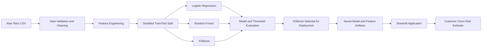
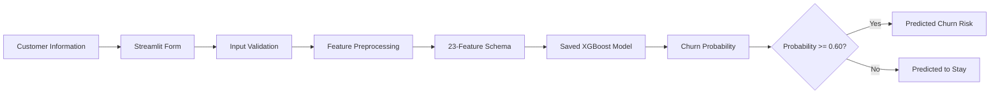

# Telco Customer Churn Prediction


An end-to-end machine-learning project for predicting customer churn in a telecommunications company. The project compares **Logistic Regression**, **Random Forest**, and **XGBoost**, then deploys the selected XGBoost model through an interactive Streamlit application.

> [!IMPORTANT]
> The goal is not simply to maximize accuracy. In a retention use case, false negatives represent customers who are likely to leave but are not identified by the model. For that reason, the project evaluates precision, recall, F1 score, ROC-AUC, confusion matrices, and threshold tradeoffs.

---

## Table of Contents

- [Project Overview](#project-overview)
- [Business Problem](#business-problem)
- [Dataset](#dataset)
- [End-to-End Pipeline](#end-to-end-pipeline)
- [Data Preparation](#data-preparation)
- [Models Evaluated](#models-evaluated)
- [Why XGBoost Was Selected](#why-xgboost-was-selected)
- [Model Comparison](#model-comparison)
- [Streamlit Application](#streamlit-application)
- [Deployment Architecture](#deployment-architecture)
- [Live Demo](#live-demo)
- [Repository Structure](#repository-structure)
- [Getting Started](#getting-started)
- [Interpreting the Results](#interpreting-the-results)
- [Known Limitations](#known-limitations)
- [Roadmap](#roadmap)

---

## Project Overview

Customer churn occurs when a customer stops using a company's services. Predicting churn can help a telecommunications company identify at-risk customers and take retention action before cancellation.

The target variable is converted into a binary outcome:

```text
0 = customer remained with the company
1 = customer churned
```

The project includes the following stages:

1. Explore and validate the Telco Customer Churn dataset.
2. Clean invalid and missing values.
3. Engineer model-ready numerical and categorical features.
4. Create a stratified train/test split.
5. Train and evaluate Logistic Regression, Random Forest, and XGBoost.
6. Compare threshold-dependent business tradeoffs.
7. Freeze the selected model and its feature schema.
8. Serve predictions through a Streamlit application.
9. Prepare the application for cloud deployment and live demonstration.

---

## Business Problem

Customer acquisition is often more expensive than customer retention. A churn-prediction system can support retention teams by ranking customers according to their estimated risk of leaving.

The project is designed to answer questions such as:

- Which customers have the highest probability of churning?
- Which account, contract, billing, or service characteristics are most useful for prediction?
- How many actual churners does each model identify?
- How many false alarms are generated by the selected threshold?
- Which model and threshold provide the most useful business tradeoff?

This is treated as a **binary classification problem**.

---

## Dataset

The project uses the Telco Customer Churn dataset stored at:

```text
telco-data/WA_Fn-UseC_-Telco-Customer-Churn.csv
```

### Dataset dimensions

```text
7,043 rows x 21 original columns
```

Each row represents one customer.

### Feature groups

| Group | Example variables |
|---|---|
| Customer demographics | `gender`, `SeniorCitizen`, `Partner`, `Dependents` |
| Account information | `tenure`, `Contract`, `PaperlessBilling`, `PaymentMethod` |
| Phone services | `PhoneService`, `MultipleLines` |
| Internet services | `InternetService`, `OnlineSecurity`, `OnlineBackup`, `DeviceProtection` |
| Support and entertainment | `TechSupport`, `StreamingTV`, `StreamingMovies` |
| Billing information | `MonthlyCharges`, `TotalCharges` |
| Target | `Churn` |

### Class imbalance

The dataset contains more non-churn customers than churn customers. Accuracy alone can therefore hide poor performance on the churn class. The analysis places special attention on:

- Churn recall
- Churn precision
- F1 score
- ROC-AUC
- False negatives
- False positives
- Confusion-matrix behavior

---

## End-to-End Pipeline



The model artifact, feature order, metadata, and test predictions are saved separately so that the Streamlit application uses the same schema as training.

---

## Data Preparation

### Customer identifier

`customerID` is an identifier rather than a predictive customer characteristic. It is excluded from model training but retained when useful for connecting test predictions to customer records.

### Total charges

`TotalCharges` may be loaded as text because some records contain blank values. It is converted to a numeric field:

```python
pd.to_numeric(df["TotalCharges"], errors="coerce")
```

Invalid or blank values become missing values and are handled during preprocessing.

### Target conversion

```text
Yes -> 1
No  -> 0
```

### Feature engineering

The deployment pipeline produces a fixed **23-feature schema** containing numerical values and encoded service/account indicators. The exact order is stored in:

```text
artifacts/feature_columns.json
```

This prevents training-serving skew by ensuring that the application passes features to XGBoost in the same order used during training.

### Train/test split

The repository contains a locked holdout set of **1,409 customers**. These records are not used to fit the final deployment model and are used to report the application metrics.

---

## Models Evaluated

### Logistic Regression

Logistic Regression was used as the interpretable baseline because it:

- Produces customer-level churn probabilities.
- Provides a clear linear baseline.
- Works well with scaled numerical variables and encoded categorical variables.
- Allows coefficients to be inspected.
- Makes threshold behavior easy to explain.

Its main limitation is that it assumes a linear relationship in the transformed feature space unless interactions are manually added.

### Random Forest

Random Forest was evaluated as a nonlinear tree ensemble because it:

- Captures nonlinear patterns and feature interactions.
- Is less dependent on scaling assumptions.
- Provides feature-importance estimates.
- Can model heterogeneous customer segments.

The initial forest showed a large train/test accuracy gap, so depth, leaf size, class weighting, and decision thresholds were evaluated to reduce overfitting and improve churn recall.

### XGBoost

XGBoost was evaluated as a boosted-tree model because it:

- Builds trees sequentially so later trees focus on earlier errors.
- Captures nonlinear relationships and feature interactions.
- Includes regularization and other controls for model complexity.
- Produces churn probabilities that can be converted into business decisions using a configurable threshold.
- Can be saved as a portable model artifact and loaded directly by the Streamlit application.

---

## Why XGBoost Was Selected

XGBoost was selected as the **deployment model**, not because it dominates every metric at every threshold, but because it provides the operating tradeoff chosen for the churn use case.

The deployed model uses a fixed threshold of **0.60** and identifies approximately **71.1% of actual churners** in the locked test set. Compared with the default Logistic Regression operating point, this reduces the number of missed churners from approximately **165 to 108**. Compared with the selected precision-constrained Random Forest operating point, it identifies more churners, while accepting additional false-positive retention contacts.

The decision reflects four design priorities:

1. **Reduce missed churners.** False negatives represent customers who leave without being flagged for intervention.
2. **Capture nonlinear behavior.** Contract type, tenure, internet service, payment method, and support features may interact in ways that a linear baseline cannot represent directly.
3. **Use probability-based decisions.** The threshold can be adjusted later based on retention budget, customer lifetime value, and intervention capacity.
4. **Support reproducible deployment.** The model, feature order, threshold, metadata, and test predictions are frozen as versioned artifacts used by the Streamlit interface.

> [!NOTE]
> Model selection is business-dependent. Logistic Regression retains advantages in interpretability and default-threshold accuracy, while Random Forest offers a competitive alternative. Before the final presentation, all three models should be rerun on the same frozen split and their final approved operating thresholds should be confirmed.

---

## Model Comparison

The following table summarizes representative test-set operating points currently documented in the repository.

| Model | Threshold | Accuracy | Precision | Recall | F1 score | ROC-AUC | False negatives | False positives |
|---|---:|---:|---:|---:|---:|---:|---:|---:|
| Logistic Regression baseline | 0.50 | 80.6% | 65.7% | 55.9% | 0.604 | 0.842 | 165 | 109 |
| Random Forest, precision-constrained | 0.61 | 77.9% | 57.4% | 65.5% | 0.612 | 0.831 | 129 | 182 |
| **XGBoost deployment model** | **0.60** | **76.1%** | **53.7%** | **71.1%** | **0.612** | **0.829** | **108** | **229** |

### Interpretation

- Logistic Regression has the strongest accuracy, precision, and ROC-AUC at its default threshold, but it misses more churners.
- Random Forest provides a middle operating point with fewer false positives than the deployed XGBoost model.
- XGBoost produces the highest churn recall among the operating points shown and the fewest false negatives, which aligns with the project's retention-focused objective.
- The XGBoost tradeoff is a larger number of false positives. In practice, the final threshold should reflect the cost and capacity of the retention campaign.

Thresholds affect precision, recall, and error counts. The comparison should therefore be interpreted as a comparison of **model-plus-threshold decisions**, not just model algorithms in isolation.

---

## Streamlit Application

The Streamlit application is implemented in:

```text
app.py
```

It contains three main sections.

### A. Customer churn prediction

A user enters the available information for one customer and selects **Estimate churn risk**. The application:

1. Validates the form values.
2. Applies the deployment preprocessing logic.
3. Reorders the engineered features using the saved feature schema.
4. Loads the saved XGBoost model.
5. Calculates churn probability.
6. Applies the fixed 0.60 decision threshold.
7. Displays the estimated risk and prediction result.

### B. Test predictions explorer

The application displays the locked test-set predictions and supports filters for:

- Correct or incorrect predictions
- Actual churn outcome
- Predicted churn outcome

Users can also download the filtered records as a CSV file.

### C. Model effectiveness

The dashboard reports:

- Accuracy
- Precision
- Recall
- F1 score
- ROC-AUC
- Confusion matrix
- Top XGBoost feature importances

---

## Deployment Architecture



The first deployment version does not require a separate FastAPI service or Docker container. Streamlit loads the frozen model and supporting artifacts directly.

---

## Live Demo

### Links

- **Live Streamlit application:** Add the deployed application URL here.
- **Presentation slides:** Add the final slide deck URL here.
- **Recorded demonstration:** Add the recording URL here if available.

### Suggested 1–2 minute demonstration

1. Open the deployed Streamlit application.
2. Briefly explain the 0.60 threshold and the customer input form.
3. Enter a high-risk profile, such as a newer month-to-month customer using electronic check.
4. Select **Estimate churn risk** and explain the resulting probability.
5. Show the test predictions explorer and filter to incorrect predictions.
6. Show the model metrics, confusion matrix, and top features.
7. Conclude by explaining the false-negative versus false-positive business tradeoff.

### Demo fallback plan

To avoid presentation problems caused by internet or hosting issues, prepare:

- A short screen recording of the complete workflow
- Screenshots of each application section
- A slide containing the model metrics and confusion matrix
- A QR code and clickable link to the deployed application

---

## Repository Structure

```text
telco-churn-predictor/
├── .streamlit/
│   └── config.toml
├── artifacts/
│   ├── feature_columns.json
│   ├── feature_importance.csv
│   ├── meta.json
│   └── test_predictions.csv
├── models/
│   └── xgboost_churn.json
├── rf-docs/
├── scripts/
│   └── train_xgboost_artifacts.py
├── src/
│   ├── __init__.py
│   └── preprocessing.py
├── telco-data/
│   ├── WA_Fn-UseC_-Telco-Customer-Churn.csv
│   ├── X_train.csv
│   ├── X_test.csv
│   ├── y_train.csv
│   └── y_test.csv
├── app.py
├── DEPLOYMENT.md
├── eda-telco.ipynb
├── feature-engineering.ipynb
├── random-forest-model.ipynb
├── xgboost.ipynb
├── requirements.txt
└── README.md
```

---

## Getting Started

### 1. Clone the repository

```bash
git clone https://github.com/abdonkath/telco-churn-predictor.git
cd telco-churn-predictor
```

To test the Streamlit feature branch before it is merged:

```bash
git switch feature/streamlit-deployment
```

### 2. Create a virtual environment

#### Windows Command Prompt

```cmd
python -m venv .venv
.venv\Scripts\activate
```

#### Windows PowerShell

```powershell
python -m venv .venv
.\.venv\Scripts\Activate.ps1
```

#### macOS or Linux

```bash
python3 -m venv .venv
source .venv/bin/activate
```

### 3. Install dependencies

```bash
pip install -r requirements.txt
```

### 4. Run the application

```bash
streamlit run app.py
```

Or:

```bash
python -m streamlit run app.py
```

The local application should become available at:

```text
http://localhost:8501
```

### 5. Regenerate deployment artifacts

The existing artifacts are already included for reproducible demonstration. To retrain and regenerate them from the repository's frozen training and testing files:

```bash
python scripts/train_xgboost_artifacts.py
```

Review metric changes before committing regenerated artifacts.

---

## Interpreting the Results

### Confusion matrix

- **True negatives:** customers correctly predicted to stay
- **False positives:** customers predicted to churn who actually stayed
- **False negatives:** customers predicted to stay who actually churned
- **True positives:** customers correctly predicted to churn

For retention use cases, false negatives can be especially costly because the company fails to identify a customer who leaves. False positives also matter because they may consume retention resources unnecessarily.

### ROC-AUC

ROC-AUC measures the model's ability to rank churners above non-churners across classification thresholds. It should not be interpreted as the performance of one specific threshold.

### Threshold analysis

- Lower thresholds generally increase recall and the number of customers contacted.
- Higher thresholds generally increase precision but may miss more churners.
- The best operational threshold depends on retention cost, campaign capacity, customer value, and the cost of a missed churner.

### Feature importance

XGBoost feature importance indicates which engineered features contributed most strongly to the model's tree decisions. Importance values are useful for model inspection but should not automatically be interpreted as causal relationships.

---

## Known Limitations

1. **Single historical dataset:** performance may change across companies, regions, or time periods.
2. **No causal interpretation:** the models identify predictive associations, not causes of churn.
3. **Class imbalance:** accuracy can look acceptable even when churn recall is weak.
4. **Threshold depends on business costs:** the current 0.60 threshold is a project decision, not a universal optimum.
5. **No external validation:** the model has not been tested on another provider or a later time period.
6. **No automated retraining or drift monitoring:** the deployed application uses a frozen model artifact.
7. **Feature-importance limitations:** model importance does not measure causal impact and may be affected by correlated features.
8. **Demonstration deployment:** the Streamlit app is a project demonstration, not a fully monitored production retention system.

---

## Roadmap

- [x] Clean and explore the Telco Customer Churn dataset.
- [x] Engineer a fixed feature schema.
- [x] Create stratified training and testing data.
- [x] Train a Logistic Regression baseline.
- [x] Train and tune Random Forest models.
- [x] Train and evaluate XGBoost.
- [x] Compare model and threshold tradeoffs.
- [x] Save the XGBoost deployment artifact.
- [x] Build the Streamlit customer prediction form.
- [x] Add the test prediction explorer.
- [x] Add metrics, confusion matrix, and feature importance.
- [x] Add local deployment instructions.
- [ ] Confirm the final comparison table using one frozen evaluation protocol.
- [ ] Deploy the Streamlit application publicly.
- [ ] Add the public application link and QR code.
- [ ] Add the presentation deck and recorded demonstration.
- [ ] Add SHAP or another local explanation method.
- [ ] Add automated tests, data-drift monitoring, and retraining workflows.

---

## Project Status Summary

| Component | Status |
|---|---|
| Dataset loading and validation | Complete |
| Exploratory data analysis | Complete |
| Feature engineering | Complete |
| Logistic Regression baseline | Complete |
| Random Forest evaluation | Complete |
| XGBoost evaluation | Complete |
| Model and threshold comparison | Complete; final team confirmation recommended |
| Saved deployment model | Complete |
| Streamlit prediction interface | Complete |
| Test prediction explorer | Complete |
| Metrics and model visualizations | Complete |
| Local application testing | Complete |
| Public Streamlit deployment | Pending |
| External validation | Not implemented |
| Automated monitoring and retraining | Not implemented |

---

## Conclusion

This project demonstrates a complete machine-learning workflow for telecommunications churn prediction, from data preparation and multi-model evaluation to an interactive deployment.

Logistic Regression provides an interpretable baseline, Random Forest provides a nonlinear ensemble comparison, and XGBoost serves as the selected deployment model. The final choice reflects the project's emphasis on identifying more at-risk customers while making the cost of additional false positives explicit.

The Streamlit application turns the model into a usable demonstration by allowing customer-level risk estimates, exploration of locked test predictions, and transparent review of the final model metrics.
